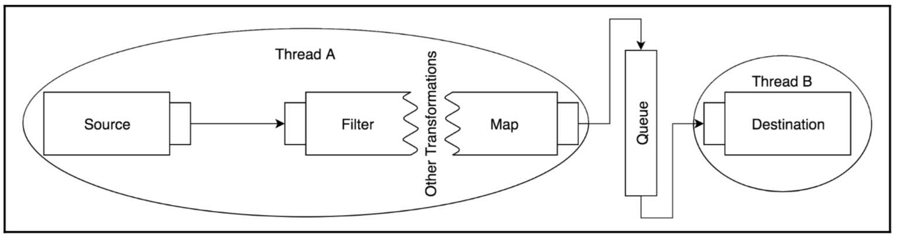

### 리액티브 스트림 기술 호환성 키드(TCK)

* 리액티브 기술의 조합에 호환성을 검사하기 위해 사용
* TCK는 사양에 정의 된 모든 규칙을 포함하는 것을 목표로하지만 사양에 요약 된 일부 규칙의 경우 자동화 된 테스트를 구성하는 것이 불가능 
* (또는 실행 가능)하므로 TCK가 구현을 완전히 검증한다고 주장 할 수는 없지만 매우 유용합니다.


 ```xml
<dependency>
  <groupId>org.reactivestreams</groupId>
  <artifactId>reactive-streams-tck</artifactId>
  <version>1.0.3</version>
  <scope>test</scope>
</dependency>
 ```

테스트는 다음과 같은 4가지 방식으로 분할됩니다.<br>

* `PublisherVerification`
* `SubscriberWhiteboxVerification`
* `SubscriberBlackboxVerification`
* `IdentityProcessorVerification`


### 리액티브 스트림을 활용한 비동기 및 병렬처처리

* 자원을 어떻게 효율적으로 활용할 수 잇을까?
* 처리 작업을 다른 스레드로 분할하는 것은 자유롭지 않고 
* 분할영역을 정의하고 효울적인 처리간에 균형을 유지하는 것이 중요한데 쉽지 않다.
* 이러한 어려움을 리액트 프러젝트 , 리액티브 라이브러리가 api를 제공해준다

* `일반적인 처리 파이프`
 


* 데이터 소스 및 목적지와 함께 몇가지 처리 또는 변환작업을 포함
* 각 처리단계는 처리 시간이 길어질 수 있고 , 다른 작업을 지연 시킬 수 있다.



* 독립적인 스레드 간에 처리를 분할함으로서 전체적인 처리를 병렬로 처리


* 메세지 생상 , 소비가 모두 cpu가 집약적인 작업의 경우
* 완전히 별개의 스레드에서 실행하도록


### 리액티브 스트림 스펙의 가치

#### JDK9

* 리액티브 스트림 스펙을 jdk9에 추가함
* 리액티브 스트림 스펙에 정의된 모든 인터페이스는 `java.util.concurrent.Flow` 클래스내에 정적 하위 클래스로 제공
* 리액티브 스트림 스펙은 리액티브 스트림 타입을 jdk flow타입으로 변환할 수 있는 추가모듈을 제공

 ```java

import java.util.concurrent.Flow; // jdk9
import org.reactivestreams.Publisher;

리액티브 스트림 라이브러리에서 Publisher를 import 하였고
리액티브 스트림의 모든 인터페이스에 대한 액세스 포인트 jdk9로 이식된 Flow를 import


public class AdapterExample {

    public static void main(String[] args) {
        Flow.Publisher jdkPublisher = ....;
        Publisher external = FlowAdapters.toPublisher(jdkPublisher);
        Flow.Publisher jdkPublisher2 = FlowAdapters.toFlowPublisher(
                external

        
        Flow.publisher를 org.reactivestreams.Publisher로 쉽게 변환할 수 있다.

        );

.....


 ```


#### RxJava의 변화

* RxJava는 하나의 리액티브 타입을 다른 리액티브 타입으로 쉽게 변환해주는 `추가 모듈`을 제공합니다.
* RxReactiveStreams 클래스는 Observable을 리액티브 스트림의 Publisher로 쉽게 변환하게 도와줌.

* `RxReactiveStreams.toPublisher()`
* `RxReactiveStreams.toSubscriber()`
* `RxReactiveStreams.toObservable()`
    
```java

@Service
public class RxLogService implements LogService {

    final HttpClient<ByteBuf, ByteBuf> rxClient =
            HttpClient.newClient(new InetSocketAddress(8080));

    @Override
    public Publisher<String> stream() {
        Observable<String> rxStream = rxClient.createGet("/logs")
                                              .flatMap(HttpClientResponse::getContentAsServerSentEvents)
                                              .map(ServerSentEvent::contentAsString);

        return RxReactiveStreams.toPublisher(rxStream);
    }
}

```


#### Vert.x의 적응

* Vert.x에는 리액티브 스트림 API에 대한 지원을 제공해주는 추가 모듈이 포함
* ReactiveReadStream은  모든 Publisher를 Vert.x API와 호환되는 데이터 소스로 변환 가능
    
```java

vertx.createHttpServer()
             .requestHandler(request -> {

                 ReactiveReadStream<Buffer> rrs = ReactiveReadStream.readStream();
                 HttpServerResponse response = request.response();

                 Flowable<Buffer> logs = Flowable.fromPublisher(logsService.stream())
                                                 .map(Buffer::buffer)
                                                 .doOnTerminate(response::end);

                 logs.subscribe(rrs);

                 response.setStatusCode(200);
                 response.setChunked(true);
                 response.putHeader("Content-Type", "text/plain");
                 response.putHeader("Connection", "keep-alive");

                 Pump.pump(rrs, response)
                     .start();
             })
             .listen(8080);


```


#### Ratpack의 개선

* 웹 프레임워크 Ratpack도 리액티브 스트림을 지원
* Vert.x와 달리 Ratpack도 리액티브 스트림을 직접 지원
* Ratpack에는 모든 Publisher를 TransformablePublisher로 변환하는 정적 팩토리가 있다.
* TransformablePublisher는 익숙한 연산자들과 변형 단계를 사용해 유연하게 이벤트 스트릠을 처리할 수 있다.
    
```java

Publisher<String> logs = logsService.stream();

TransformablePublisher publisher = Streams
                    .transformable(logs)
                    .filter(this::filterUsersSensitiveLogs)
                    .map(this::escape);


```

 ```java

RatpackServer.start(server ->               // 1. 서버 시작 및 요청 핸들러 선언
                server.handlers(chain ->
                        chain.all(ctx -> {

                            Publisher<String> logs = logsService.stream();  // 2. 로그 스트림 선언

                            // 3. serverSentEvents 클래스는 매핑 단계에서 Publisher의 원소를
                            serverSentEvents의 표현식으로 변환하는 역할을 수행합니다.

                            ServerSentEvents events = serverSentEvents( 
                                    logs,
                                    event -> event.id(Objects::toString)
                                                  .event("log")
                                                  .data(Function.identity())
                            );

                            ctx.render(events); // 4. 입출력에 대한 스트림을 렌더링합니다.
                        })
                )
        );

 ```

#### 리액티브 스트림 기반의 MongoDB 드라이버 

* 프레임워크 또는 라이브러리에 국한되지 않고 리액티브 스트림 기반의 MongoDB 드라이버를 제공
* `7장 리액티브 방식으로 데이터베이스 사용하기`에서 자세히 공부


#### 라액티브 기술 조합

* 3개의 리액티브 라이브러리가 포함된 소스
* RxReactiveStreams을 통해 쉽게 observable을 publisher로 변환

 ```java

import ratpack.stream.TransformablePublisher;
import rx.RxReactiveStreams;

@SpringBootApplication
@EnableRatpack  // 웹 프레임워크 Ratpack 서버 자동 설
public class NewsServiceApp {

    @Bean
    MongoClient mongoClient(MongoProperties properties) {
    ..
    }

    @Bean
    DatabaseNewsService databaseNews() { // 뉴스 서비스 검색을 위한 서비스 빈
    ..
    }

    @Bean
    HttpNewsService externalNews() { // 뉴스 서비스 검색을 위한 서비스 빈
    ..
    }

    @Bean
    public Action<Chain> home() {
        return chain -> chain.get(ctx -> {

            FindPublisher<News> databasePublisher =
                    databaseNews().lookupNews();
            Observable<News> httpNewsObservable =
                    externalNews().retrieveNews();
            TransformablePublisher<News> stream = Streams.merge( // ratpack.stream api을 사용해 병합
                    databasePublisher,
                    RxReactiveStreams.toPublisher(httpNewsObservable)
            );

            ctx.render(
                    stream.toList()
                          .map(Jackson::json)
            );
        });
    }


 ```


 