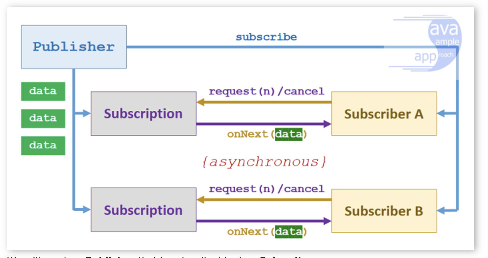
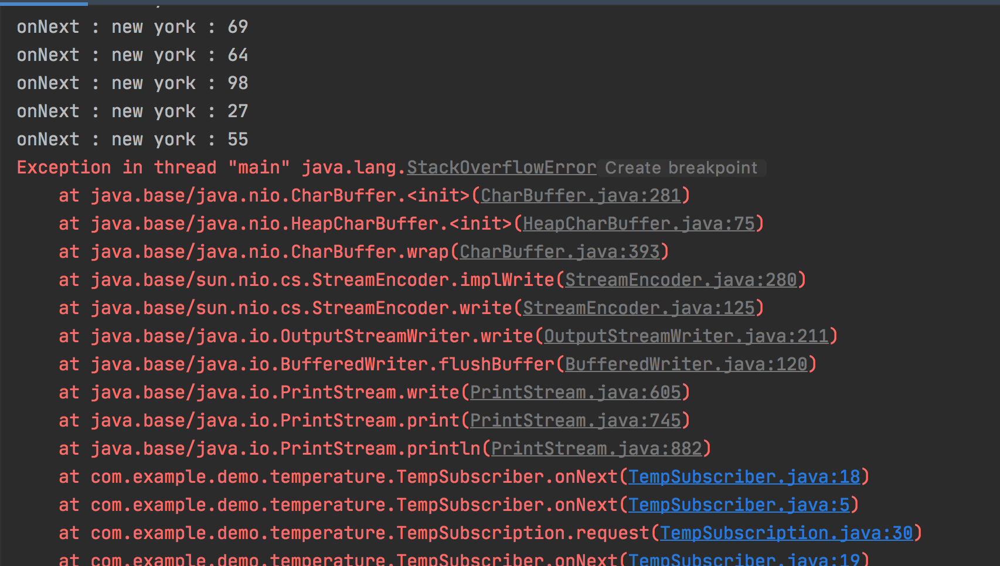

### 리액티브 스트림은

리액티브 스트림은 잠재적으로 `무한의 비동기 데이터`를 순서대로 그리고<br>
`블록하지 않는 역압력을 전제`해 처리하는 표준 기술이다.

역압력이나 제어 흐름 기법이 필요<br>
* 데이터 수신자가 스레드를 블록하지 않고도 데이터 수신자가 처리할 수 없을만큼 많은 데이터를 받는 일을 방지하는 프로토콜을 제공
* 비동기 api를 이용하면 하드웨어 사용률을 극대화할 수 있지만 다른 느린 다운스트림 컴포넌트에 너무 큰 부하를 줄 가능성이 생김


### Flow 클래스 소개

리액티브 스트림 프로젝트 표준에 따라 프로그래밍 발생 - 구독 모델을 지원할 수 있도록
Flow클래스는 중첩된 인터페이스 4개를 포함한다.




```java

   @FunctionalInterface
   public static interface Publisher<T> {
       public void subscribe(Subscriber<?superT> subscriber);
   }
   public static interface Subscriber<T> {
       public void onSubscribe(Subscription subscription);
       public void onNext(Titem);
       public void onError(Throwable throwable);
       public void onComplete();
   }
   public static interface Subscription {
       public void request(long n);
       public void cancel();
   }
   public static interface Processor<T,R> extends Subscriber<T>, Publisher<R> {
   }

```

* Publisher
   > 항목 발행
* Subscriber
   > Subscriber 인터페이스는  publisher가 관련 이벤트를 발생할 때 호출할 수 있도록 콜백 메서드를 정의
   > Publisher가 관련 이벤트를 발행할 때 호출할 수 있도록 콜백 메서드 4개를 정의
* Subscription
   > 과정을 관리
   > Publisher , Subscriber 사이의 제어 흐름 , 역압력을 관리
* Processor


* `Subscriber`
   * onSubscribe(Subscription s)
       > Subscriber가 Publisher에 자신을 등록할 때 Publisher는 처음으로 onSubscribe 메서드를 호출해 Subscription 객체를 전달
   * onNext(T t)
       > 메소드 내에서 게시자가 항목 처리를 완료하자마자 다른 항목을 수락 할 준비가 되었음을 게시자에게 알림
   * onError(Throwable t)
       > Publisher에 장애가 발생했을 때 호출
   * onComplete()
       > 이벤트 스트림은 영원히 지속되거나 아니면 onComplete 콜백을 통해 더 이상의 데이터가 없고 종료됨을 알림
   
* `Subscription`
   * request(long n)
       > Publisher에게 주어진 개수의 이벤트를 처리할 준비가 되었음을 알림
   * cancel()
       > Publisher에게 더이상 이벤트를 받지 않음 통지


### 자바 9 플로 명세서의 규칙 집합 정의

* Publisher는 반드시 Subscription의 request 메서드의 정의된 개수 이하의 요소만 Subscriber에 전달해야한다.
* Publisher는 지정된 개수보다 적은 수의 요소를 onNext로 전달할 수 있다.
* 성공적으로 끝났으면 onComplete를 호출하고 문제가 발생하면 onError를 호출해 Subscription을 정료
* Subscriber는 요소를 받아 처리할 수 있음을 Publisher에 알려야한다.
* 이런방식으로 Subscriber는 Publisher에 역압력을 행사할 수 있고 Subscriber가 관리할 수 없이 너무 많은 요소를 받는일을 피한다.
* onComplete나 onError 신호를 처리하는 상황에서는 Subscriber는 Publisher나 Subscription의<br>
    어떤 메서드도 호출할 수 없으며 Subscription이 취소되었다고 가정해야 한다.
* Subscriber는 Subscription.request() 메서드 호출이 없이도 언제든 종료 시그널을 받을 준비가 되어 있어야한.디.
* Subscription.cancel()이 호출된 이후에라도 한개 이상의 onNext를 받을 준비가 되어 있어야 한다.


* `현재 보고된 온도를 전달하는 자바 빈`
```java

import java.util.Random;

public class TempInfo {
    public static final Random random = new Random();

    private final String town;
    private final int temp;

    public TempInfo(String town, int temp) {
        this.town = town;
        this.temp = temp;
    }

    // 정적 팩토리 메서드를 이용해 해당 도시의 TempInfo 인스턴스를 만든다
    public static TempInfo fetch(String town){
        if(random.nextInt(10) == 0)
            throw new RuntimeException("Error!");

        return new TempInfo(town,random.nextInt(100));
    }

    @Override
    public String toString() {
        return town+" : "+temp;
    }

    public int getTemp(){
        return temp;
    }

    public String getTown(){
        return town;
    }
}

```

* `받은 온도를 출력하는 Subscriber`

```java
import java.util.concurrent.Flow;

public class TempSubscriber  implements Flow.Subscriber<TempInfo> {
    private Flow.Subscription subscription;

    // 구독을 저장하고 첫 번재 요청을 전달
    @Override
    public void onSubscribe(Flow.Subscription subscription) {
        this.subscription =subscription;
        subscription.request(1);
    }

    // 수신한 온도를 출력하고 다음 정보를 요청
    @Override
    public void onNext(TempInfo tempInfo) {
        System.out.println("onNext : "+tempInfo);
        subscription.request(1);
    }

    // 에러가 발생하면 에러 메세지 출력
    @Override
    public void onError(Throwable throwable) {
        System.out.println(throwable.getMessage());
    }

    @Override
    public void onComplete() {
        System.out.println("Done!");
    }
}

```


* `Subscriber에게 Templnfo 스트림을 전송하는 Subscription`
```java

import java.util.concurrent.Flow;

public class TempSubscription implements Flow.Subscription {
    private final Flow.Subscriber<? super TempInfo> subscriber;
    private final String town;

    public TempSubscription(Flow.Subscriber<? super TempInfo> subscriber, String town) {
        this.subscriber = subscriber;
        this.town = town;
    }

    // 구독이 취소되면 완료
    @Override
    public void cancel() {
        subscriber.onComplete();
    }

    @Override
    public void request(long n) {
        for(long i=0; i < n;i++){
            try{
                subscriber.onNext(TempInfo.fetch(town));
            }catch (Exception e){
                subscriber.onError(e);
                break;
            }
        }
    }
}


```


* `Publisher를 만들고 TempSubscriber를 구독시킴`

```java
import java.util.concurrent.Flow;

// Publisher를 만들고 TempSubsciber를 이용해 Publisher에 구독하도록
public class Main {
    public static void main(String[] args) {
        //TempSubsciber를 이용해 Publisher에 구독
        getTemperature("new york").subscribe(new TempSubscriber());
    }

    // 뉴욕에 보고할 Publisherd을 만들고
    // TempSubscriber클래스 인스턴스를 구독시킨다.
    private static Flow.Publisher<TempInfo> getTemperature(String town){
        return subscriber -> subscriber.onSubscribe(
                new TempSubscription(subscriber,town)
        );
    }
}

```

* 여기서 fetch 메서드에서 random.nextInt(10) == 0 부분을 없애고 무한히 실행하게 한다면?




* 하나의 스레드로 하는 경우 재귀호출로 걔속 호출하기 때문에 스택 오버플로가 발생하는 문제를 해결하기 위해
* 다른 스레드에서 TempSubsciber로 세 요소를 전달


```java
private static final ExecutorService executor = Executors.newSingleThreadExecutor();

    // 하나의 스레드로 하는 경우 스택 오버플로가 발생하는 문제를 해결하기 위해
    // 다른 스레드에서 TempSubsciber로 세 요소를 전달
    @Override
    public void request(long n) {
        executor.submit(() ->{
            for(long i=0; i < n;i++) {
                try {
                    subscriber.onNext(TempInfo.fetch(town));
                } catch (Exception e) {
                    subscriber.onError(e);
                    break;
                }
            }
        });

    }

```

#### Processor로 데이터 변환하기

* Proccessor는 Subsciber이며 동시에 Publisher다.
* Processor의 목적은 Publisher를 구독한 디음 수신한 데이터를 가공해 다시 제공


`화씨를 섭씨로 변환하는 Processor`<br>

```java
import java.util.concurrent.Flow;

// TempInfo를 다른 TempInfo로 변
public class TempProcessor implements Flow.Processor<TempInfo,TempInfo> {
    private Flow.Subscriber<? super TempInfo> subscriber;


    @Override
    public void onSubscribe(Flow.Subscription subscription) {
        subscriber.onSubscribe(subscription);
    }

    // 섭씨로 변환한 다음  Templnfo를 다시 전송
    @Override
    public void onNext(TempInfo temp) {
        subscriber.onNext( new TempInfo( temp.getTown(), (temp.getTemp() - 32) * 5 / 9) );
    }

    @Override
    public void onError(Throwable throwable) {
        subscriber.onError(throwable);
    }

    @Override
    public void onComplete() {
        subscriber.onComplete();
    }

    @Override
    public void subscribe(Flow.Subscriber<? super TempInfo> subscriber) {
        this.subscriber = subscriber;
    }
}

```


```java


import java.util.concurrent.Flow;

public class Main {
    public static void main(String[] args) {
        //TempSubsciber를 이용해 Publisher에 구독
        getCelsiusTemperatures("new york").subscribe(new TempSubscriber());
    }

    public static Flow.Publisher<TempInfo> getCelsiusTemperatures(String town){
        return subscriber -> {
          TempProcessor processor = new TempProcessor();
          processor.subscribe(subscriber);
          processor.onSubscribe(new TempSubscription(processor,town));
        };
    }

}

```

#### java9 flow는 왜 api구현을 제공하지 않는가?


* Rxjava는 Flow.Publisher를 구현하는 두 클래스를 제공
    * 당김 기반 역압력 기능(request 메서드)이 있는 Flow를 포함하는 io.reactivex.Flowable
    * 기존 버전에서 제공하던 Publisher(io.reactivex.Observable)


#### Observable 만들고 사용하기


* Observable , Flowable 클래스는 다양한 종류의 리액티브 스트림을 편리하게 만들 수 있도록 여러 팩토리 메서드를 제공

* `create() 연산자`

    * Observable.create()를 사용하면 Emitter를 이용하여 직접 아이템을 발행하고
    * 아이템 발행의 완료나 오류(Complete/Error)의 알림을 직접 설정할 수 있다.
    
```java

Observable<String> source = Observable.create(emitter -> {
    emitter.onNext("Hello");
    emitter.onNext("Yena");
    emitter.onComplete();
});
source.subscribe(System.out::println);

[출력결과]
Hello
Yena

```

* `just() 연산자`

just()는 해당 아이템을 그대로 발행하는 Observable을 생성해준다. <br>
just() 연산자의 인자로 넣은 아이템을 차례로 발행하며, 한 개의 아이템을 넣을 수도 있고, 타입이 같은 여러 아이템을 넣을 수도 있다.

```java

Observable<String> source = Observable.just("Hello", "Yena");
source.subscribe(System.out::println());

[출력결과]
Hello
Yena

```


* `interval`

* Rxjava에서 Observable => flow api에 Publisher 역할을 / Observer는 Flow의 Subscriber 역할을
* RxJava에서는 Observable을 구독하는 Observer가 존재하고, Observable이 순차적으로 발행하는 데이터에 대해서 반응한다. 

* `Observable은 다음의 3가지 이벤트`를 사용하여 동작한다.
    * onNext() : 하나의 소스 Observable에서 Observer까지 한 번에 하나씩 순차적으로 데이터를 발행한다.
    * onComplete() : 데이터 발행이 끝났음을 알리는 완료 이벤트를 Observer에 전달하여 onNext()를 더 호출하지 않음을 나타낸다.
    * onError() : 오류가 발생했음을 Observer에 전달한다.
    * 위 이벤트들은 Emitter라는 인터페이스에 의해 선언된다.

>> Emit [imít] 1.방출하다 2.내뿜다 3.발산하다

그리고 데이터나 오류 내용을 발행할 때 null은 발행할 수 없다.<br>


* `Subscriber 역할을 하는 Observer`

```java

import com.example.demo.temperature.TempInfo;
import io.reactivex.Observer;
import io.reactivex.disposables.Disposable;

//Subscriber
public class TempObservber implements Observer<TempInfo> {
    @Override
    public void onSubscribe(Disposable disposable) {

    }

    @Override
    public void onNext(TempInfo tempInfo) {
        System.out.println(tempInfo);
    }

    @Override
    public void onError(Throwable throwable) {
        System.out.println("Got problem : "+throwable.getMessage());
    }

    @Override
    public void onComplete() {
        System.out.println("Done!");
    }
}

```

```java

public class Main {
    public static void main(String[] args) {
        //rx
        Observable<TempInfo> observable = getRxTemperature("new york");
        observable.blockingSubscribe(new TempObservber());
    }

    // rxjava
    public static Observable<TempInfo> getRxTemperature(String town){
        return Observable.create(emitter ->
                Observable.interval(1, TimeUnit.SECONDS)
                            .subscribe(i -> {
                                if(!emitter.isDisposed()){
                                    if(i >=5){
                                        emitter.onComplete();
                                    }else{
                                        try{
                                            emitter.onNext(TempInfo.fetch(town));
                                        }catch (Exception e){
                                            emitter.onError(e);
                                        }
                                    }

                                }
                            })
                );
    }


}


```

#### Observable을 변환하고 합치기
* RxJava나 기타 리액티브 라이브러리는 자바 9플로 api에 비해 스트림을 합치고, 만들고, 거르는 등의 풍부한 도구상자를 제공


* `Observable이 map을 이용해 화씨를 섭씨로 변환`

```java

public class Main {
    public static void main(String[] args) {
         //rx 스트림 변환
        Observable<TempInfo> observable = getRsCelsiusTemperatures("new york");
        observable.blockingSubscribe(new TempObservber());
    }
...
// rxjava
    public static Observable<TempInfo> getRxTemperature(String town){
        return Observable.create(emitter ->
                Observable.interval(1, TimeUnit.SECONDS)
                            .subscribe(i -> {
                                if(!emitter.isDisposed()){
                                    if(i >=5){
                                        emitter.onComplete();
                                    }else{
                                        try{
                                            emitter.onNext(TempInfo.fetch(town));
                                        }catch (Exception e){
                                            emitter.onError(e);
                                        }
                                    }

                                }
                            })
                );
    }

    //rx map을 이용한 스트림변환
    public static Observable<TempInfo> getRsCelsiusTemperatures(String town){
        return getRxTemperature(town)
                    .map(temp -> new TempInfo(temp.getTown(),(temp.getTemp()-32) * 5/9))
                    ;
    }

```


* `rx filter를 이용한 영하 온도만 거르기`

```java

// rxjava
public static Observable<TempInfo> getRxTemperature(String town){
    return Observable.create(emitter ->
            Observable.interval(1, TimeUnit.SECONDS)
                        .subscribe(i -> {
                            if(!emitter.isDisposed()){
                                if(i >=5){
                                    emitter.onComplete();
                                }else{
                                    try{
                                        emitter.onNext(TempInfo.fetch(town));
                                    }catch (Exception e){
                                        emitter.onError(e);
                                    }
                                }

                            }
                        })
            );
}

//rx filter를 이용한 영하 온도만 거르기
public static Observable<TempInfo> getNegativeTemperatures(String town){
    return getRsCelsiusTemperatures(town)
            .filter(temp -> temp.getTemp() < 0);
}

```


